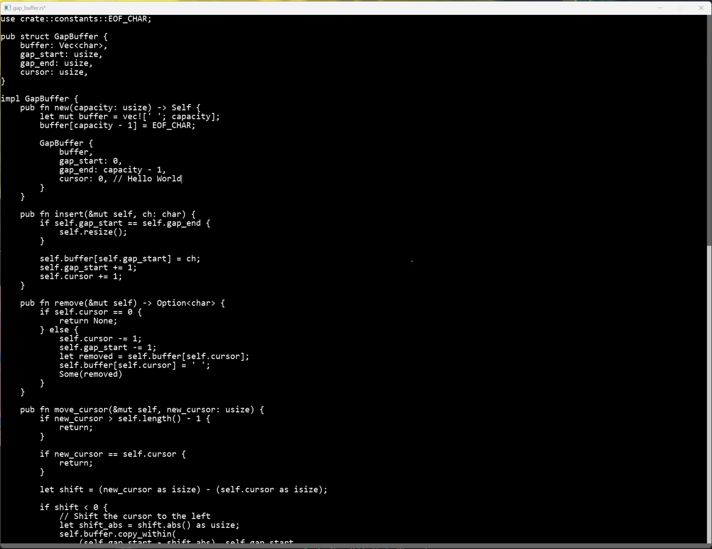

# Rust Text editor

## How to Build:
1. Install sdl2 https://github.com/Rust-SDL2/rust-sdl2
2. cargo run

# How to use:
Ctrl + o : Opens up a file dialog select a file to open.

Ctrl + S : Saves file if already open. 

